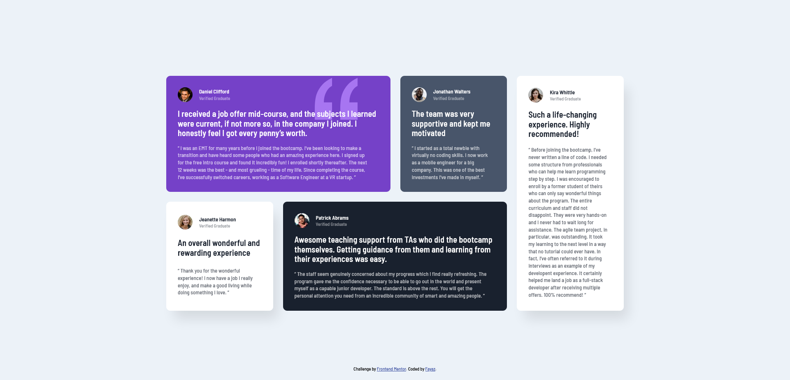

# Frontend Mentor - Testimonials grid section solution

This is a solution to the [Testimonials grid section challenge on Frontend Mentor](https://www.frontendmentor.io/challenges/testimonials-grid-section-Nnw6J7Un7). Frontend Mentor challenges help you improve your coding skills by building realistic projects.

## Table of contents

- [Overview](#overview)
  - [The challenge](#the-challenge)
  - [Screenshot](#screenshot)
  - [Links](#links)
- [My process](#my-process)
  - [Built with](#built-with)
  - [What I learned](#what-i-learned)
  - [Useful resources](#useful-resources)

## Overview

### The challenge

Users should be able to:

- View the optimal layout for the site depending on their device's screen size

### Screenshot

- Desktop
  

- Mobile
  

### Links

- Solution URL: [github repo](https://github.com/fayax555/fem-challenges/tree/main/testimonials-grid-section)
- Live Site URL: [live url](https://fayax555.github.io/fem-challenges/testimonials-grid-section/)

### Built with

- Semantic HTML5 markup
- Flexbox
- CSS Grid
- Mobile-first workflow

### What I learned

The code below was used to hide horizontal scrollbar as much as possible until the minimum height for grid elements was reached.

```css
main {
  padding: clamp(2rem, 48vh - 17.8rem, 25rem);
}
```

### Useful resources

- [CSS Tricks - visually hidden class](https://css-tricks.com/inclusively-hidden/) - used the example code from this article for the visually hidden class, which was used to hide h1 tag.
- [fluid typography tool](https://fluid-typography.netlify.app/) - This tool was used to adjust horizatal padding of 'main' based on viewport heights.
